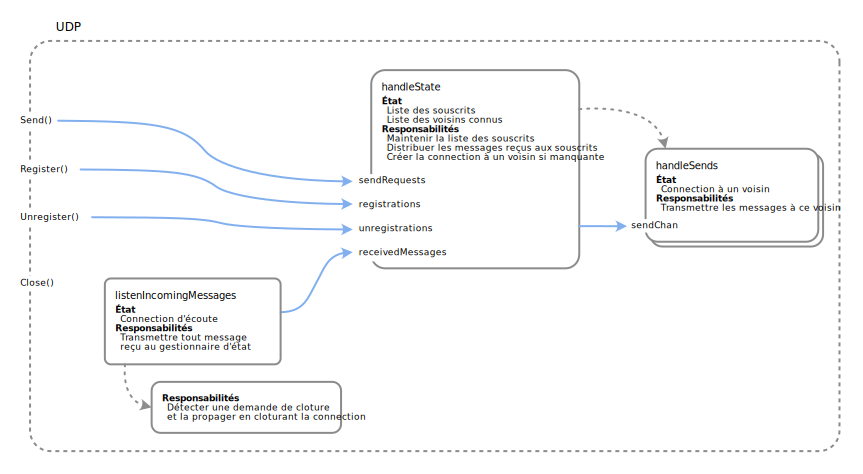

<!---
## Changelog

| Date  | Changement                                            |
| ----- | ----------------------------------------------------- |
-->

## Informations Générales

- [**Lien vers votre repo**](https://classroom.github.com/a/v8SKh8le)
- **Groupes** : à réaliser par groupes de deux.
- **Plagiat** : nous intégrerons au processus d'évaluation des outils de détection de plagiat (entre groupe, mais aussi avec les rendus des années précédentes et la solution officielle).
  En cas de suspicion, vous y serez confronté.e.s, et l'incident pourra être rapporté au responsable de la filière, avec un risque d'échec immédiat au cours.
- **IA Générative** : Nous ferons les suppositions suivantes.
    - Vous avez des objectifs qui vous sont clairs (que nous espérons être d'acquérir des compétences d'ingénieur.e).
    - Vous avez conscience que les compétences d'un.e ingénieur.e incluent une capacité de compréhension, d'évaluation et de créativité technique, qui sont aussi celles recherchées et valorisées dans l'industrie *(lire : vous visez des jobs inatteignables par des vibe-coders autodidactes)*.
    - Vous êtes des personnes responsables et adultes, capables d'agir intentionnellement, dans l'intérêt de vos objectifs.

  Par conséquent, nous supposerons que vous agirez de manière réfléchie, et avec conscience des implications de vos choix. Par ailleurs et à titre d'information, nous avons pu constater que les meilleurs outils en date ne sont pas encore capables d'atteindre nos exigences sur ces labos, qui sont suffisamment complexes pour contenir des subtilités qui leur échappent encore.

Notez enfin que l'objectif étant pour vous d'apprendre, vous serez toujours légitimes et bienvenu.e.s à nous poser des questions, sur Go, la théorie, vos idées, vos blocages. Si vous vous sentez perdu.e.s ou coincé.e.s, c'est qu'il faut nous demander.

## ChatsApp

Ce cours contiendra quatre labos consécutifs, construisant chacun sur le précédent. L'objectif final sera d'avoir construit une application de messagerie instantanée décentralisée, baptisée ChatsApp, qui sera telle que

- la communication entre serveurs sera tolérante aux pannes, pertes de messages, duplications, et réordonnancements (protocole RR, *labo 1*) ;
- l'ordre des messages sera le même pour tous les utilisateur.ices (mutex, *labo 2*) ;
- la charge sera distribuée uniformément entre les serveurs (élection, *labo 3*) ;
- le réseau pourra être incomplet (sondes et échos, *labo 4*).

ChatsApp est une application distribuée. Chaque utilisateur.ice lance l'exécutable du serveur et lui fournit sa configuration. Durant le développement, la commande `go run` peut être utilisée.

```sh
go run ./cmd/server/main.go <local_address> <config_file_path>
```

- `<local_address>` est l'adresse IP sur laquelle ce serveur recevra les connexions d'autres serveurs,
- `<config_file_path>` est le chemin d'accès au fichier de configuration de ce serveur.

Ce fichier de configuration est au format JSON, et inclut les champs suivants :

- `Username` - pseudonyme au nom duquel ce serveur enverra les messages aux autres serveurs
- `Neighbors` - tableau de chaines de caractères listant les adresses IP des voisins de ce serveur sur le réseau
- `PrintReadAck` - booléen indiquant si le serveur doit afficher un accusé de réception suite à l'envoi de chaque message
- `Debug` - booléen indiquant si les logs doivent être affichées sur stdout
- `LogPath` - chemin d'accès à un répertoire dans lequel sera créé un fichier contenant les logs
- `SlowdownMs` - en millisecondes, ralentissement artificiel du serveur après chaque réception et envoi de message

Une fois lancé, un serveur attend qu'un message soit entré sur la ligne de commande pour l'envoyer à tous ses voisins. Ces derniers l'afficheront dans la console sous le format `<user>: <message>`, suivit d'un saut de ligne.

Si `PrintReadAck` est configuré à `true`, l'envoyeur affichera un message de la forme `[<neighbor_address> received: <message>]` dès que le voisin d'adresse IP `<neighbor_address>` l'informe avoir reçu et traité ce message.

### Format des labos

Chaque labo durera quatre semaines de cours (excepté le labo 1, qui en durera trois). Chacun se divisera en deux phases.

- **Conception** - Semaine 1
    - Réfléchissez aux abstractions à définir, leur API, et comment elles intéragiront entre elles et avec le code existant.
    - En échange avec nous, *clarifiez et créez une confiance en la solution que vous allez choisir*.
- **Validation et implémentation** - Semaines 2 à 4
    - Dernière chance pour valider votre conception lors de la séance de semaine 2, puis implémentation.
    - Le rendu final se fera sur GitHub Classroom, 1 minute avant le début du labo suivant.

Avec chaque labo, sera attendu un *document d'architecture logicielle* décrivant votre solution.

---

## Labo 1

### Introduction

Ce labo a les objectifs suivants.

- Implémentation d'un protocole de communication RR (Request-Reply).
- Intégration de RR dans le module UDP de ChatsApp.

L'intégration devra permettre de fournir un accusé de réception pour chaque message envoyé et correctement reçu par le destinataire.

### État actuel

Dans le passé, ChatsApp utilisait TCP pour la communication entre serveurs. Considéré trop lourd, le responsable du projet a décidé de le remplacer par UDP. Une implémentation fonctionnelle existe, mais elle fait perdre certaines des garanties offertes par TCP, notamment l'absence de perte de messages. L'implémentation de TCP reste disponible dans le code pour votre curiosité, mais ne sera pas utilisée dans les labos de ce cours.

<details>

<summary><span class="remark">Pour plus de détails sur l'architecture du module UDP...</span></summary>

Le module UDP se compose des goroutines suivantes.

- Une goroutine principale `handleState`, qui centralise tout l'état, c'est à dire la liste des souscrits et la liste des voisins connus. Chaque voisin est représenté par une channel sur laquelle cette goroutine enverra tout message à lui envoyer.
- Une goroutine `handleSends` par voisin connu, qui a accès à la channel correspondante à ce dernier. Elle y lit tout message transmis par la goroutine principale, et l'envoie au voisin via UDP. Elle est donc responsable de maintenir la connexion UDP avec ce voisin.
- Une goroutine `listenIncomingMessages`, qui écoute tout message reçu via UDP, et les transmet tels quels à la goroutine principale. Elle crée une petite goroutine responsable de détecter un appel à `Close()` et de cloturer la connexion UDP.

Toutes ces transmissions se font via des channels. Comme il se doit, celles-ci ne sont lues que par une seule goroutine, mais peuvent être écrites par plusieurs.



</details>

La base de code fournie inclut également un module `utils`, qui contient quelques utilitaires, notamment

- `BufferedChan` - un type représentant une channel de capacité variable (à la différence des channels natives de Go, dont la capacité est finie et fixée à la création)
- `Option` - l'implémentation d'un type optionnel, similaire à `Option` en Rust ou `Maybe` en Haskell.
- `UIDGenerator` - un générateur de nombres uniques consécutifs de valeur initiale zéro.

Vous serez libres d'utiliser ces utilitaires, mais aussi d'en ajouter d'autres si vous le jugez nécessaire.

### RR

Pour combler les lacunes du module `udp`, vous êtes chargé.e.s de

- implémenter un module de communication Request-Reply (RR), dont l'API, décrite plus bas, est fournie dans le fichier `rr.go`, et
- l'intégrer dans le module `udp` pour qu'il retrouve les garanties attendues. En particulier, toute demande d'envoi via le module `udp` doit aboutir à la réception du message par le destinataire même s'il peut être en panne récupérable, et l'envoyeur doit ensuite recevoir un accusé de réception. Il faudra aussi s'assurer qu'aucun réordonnancement ou duplication ne puisse avoir lieu.

Le module RR doit implémenter les deux cotés du protocole RR vu en cours.

- Du côté de l'envoyeur, `SendRequest` doit envoyer un message au destinataire, et retourne une channel sur laquelle sera envoyée la réponse du destinataire lorsqu'elle sera reçue.
- Du côté du destinataire, le handler configuré via `SetRequestHandler` doit être appelé à chaque fois qu'une requête est reçue du réseau. Ce handler a la responsabilité de traiter la requête, puis retourner la réponse qui sera renvoyée à l'envoyeur.

Afin de rendre le module RR indépendant du moyen de communication entre serveurs (TCP, UDP, channels, ...), il prend un `NetWrapper` en paramètre de son constructeur, qui n'est autre qu'une paire de channels :

- `IntoNet` est une channel sur laquelle le module RR pourra écrire tout message qu'il souhaite envoyer à son destinataire, et
- `FromNet` est une channel sur laquelle le module RR pourra lire tout message reçu de la part du destinataire.

### Tests

La plupart des modules du projet incluent des tests unitaires. C'est notamment le cas des modules `rr` et `udp`, qui ne passent pas tous dans l'état actuel du code.

L'évaluation de votre travail inclura le passage de tous les tests fournis, y inclus ceux des autres modules pour détecter toute régression, notamment ceux de `server`, qui dépendent d'`udp`.

Nous vous encourageons à écrire vos propres tests, mais vous ne devez pas modifier ceux fournis. Dans les prochains labos, nous nous réserverons le droit de ne pas vous fournir tous les tests utilisés pour l'évaluation.

### Document d'architecture

Votre rendu final devra inclure un document d'architecture logicielle décrivant votre solution. Son objectif sera de décrire de manière complète le fonctionnement conceptuel de votre code. Cela signifie qu'il devra notamment décrire

- toute abstraction supplémentaire que vous aurez définie (ses responsabilités, son API, etc) ;
- les différentes goroutines qui coexistent, ainsi que leur responsabilité, leur état, les channels qu'elles écoutent et d'où proviennent les messages qu'elles y lisent

Votre objectif avec ce document est de nous permettre, en le lisant, d'avoir une idée claire et complète de l'architecture de votre code, et de la manière dont ses différentes parties fonctionnent ensemble pour offrir les fonctionnalités attendues. Nous l'utiliserons comme point d'entrée à votre rendu, veillez donc à nommer clairement les objets, goroutines et channels que vous mentionnez, afin de nous permettre de les retrouver facilement dans votre code.

### Contraintes

- Aucun état variable ne doit être partagé entre goroutines. Cela inclue toutes les abstractions fournies par le package `sync` de Go (mutex, waitgroup, etc). Toute synchronisation entre goroutine doit se faire via des channels.
- Vous êtes libres (et encouragés) d'ajouter des tests, mais ne devez pas modifier ceux fournis.
- Vous pouvez ajouter des fichiers et modifier du code existant, tant que les tests fournis continuent de passer *sans modification*.
- Vous êtes libres d'ajouter des fichiers ou du code, et de modifier tout code fourni, à condition de ne pas modifier l'API ou le comportement observable des abstractions déjà présentes, ni les tests fournis.

En cas de doute, n'hésitez pas à nous demander.

### Résumé

En résumé, vous devrez dans ce labo

- Implémenter le module RR tel que décrit ici et dans le cours ;
- L'intégrer dans le module UDP de ChatsApp afin de garantir l'absence de perte de messages et la réception d'un accusé de réception pour chaque message envoyé, ainsi que l'absence de duplication et de réordonnancement ;
- Faire passer tous les tests du projet, avec la liberté d'en ajouter ;
- Rédiger un document d'architecture logicielle décrivant votre solution.

### Timeline et indications

Durant la première semaine, il est attendu que vous réfléchissiez à l'approche que vous souhaitez adopter pour implémenter ce labo. Il vous faudra notamment réfléchir à la manière de résoudre les problèmes suivants.

- Comment permettre au module RR de traiter les requêtes reçues du réseau, même lorsqu'un appel à `SendRequest` est bloqué sur l'attente de réponse du destinataire ?
- Où et comment insérer le module RR dans le module UDP ?
- Comment garantir que le module UDP sera capable de recevoir d'autres messages du réseau, même lorsqu'un appel à `SendRequest` sur une instance de RR est bloqué ?
- Votre solution garantit-elle qu'un message dont l'envoi échoue (e.g. en cas de connexion perdue) ne sera pas perdu et sera réessayé ?
- Votre solution garantit-elle que les messages ne seront jamais réordonnancés (ou dupliqués) ?

La deuxième séance de labo sera votre dernière occasion de valider auprès de nous votre proposition de solution. Une fois ce délai passé, il sera attendu que vous ayez une vision claire de votre solution, dont vous pourrez aussitôt commencer l'implémentation.

Le rendu aura lieu une minute avant le début du labo 2. Vous aurez donc trois semaines exactement.